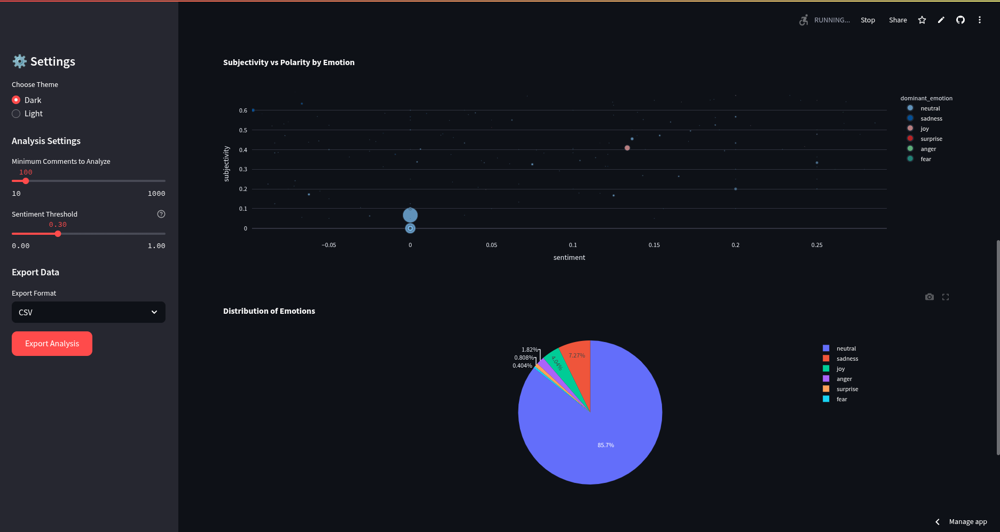
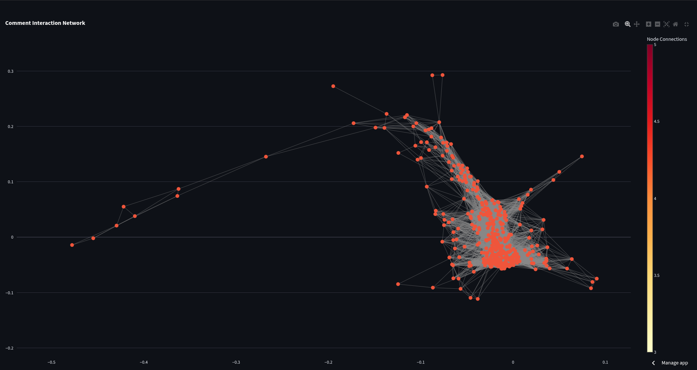
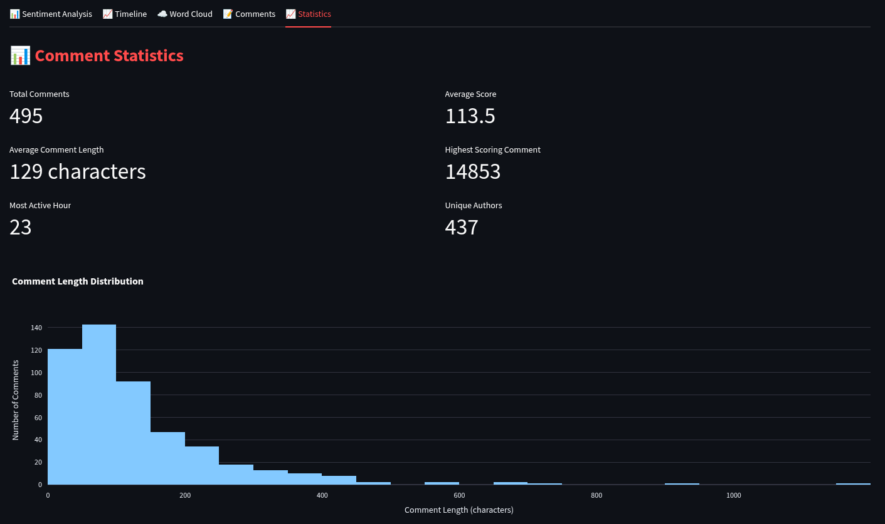

# RedditInsight

A powerful sentiment analysis tool for Reddit threads that provides detailed insights into comment sentiment, emotions, and interactions.

## ✨ Features

- **Advanced sentiment analysis using TextBlob and VADER**
- **Emotion detection and analysis**
- **Interactive visualizations with Plotly**
- **Comment interaction network analysis**
- **Time-based sentiment analysis**
- **Word cloud generation**
- **Dark/Light theme support**
- **Data export capabilities**

## 📸 Screenshots

### Interactive Charts

*Dynamic sentiment analysis charts and emotion distribution*

### Word Cloud Analysis

*Dynamic word cloud generation for comment analysis*

### Comment Interactions

*Network visualization of comment interactions and relationships*

### Statistics Dashboard

*Comprehensive statistics and metrics dashboard*

## 🚀 Getting Started

### Prerequisites

- Python 3.8 or higher
- Reddit API credentials (Client ID and Client Secret)

### Installation

1. Clone the repository:
```bash
gh repo clone Weirdnemo/RedditInsight
cd RedditInsight
```

2. Create a virtual environment and activate it:
```bash
python -m venv .venv
source .venv/bin/activate  # On Windows, use `.venv\Scripts\activate`
```

3. Install the required packages:
```bash
pip install -r requirements.txt
```

### Configuration

1. Get your Reddit API credentials:
   - Go to https://www.reddit.com/prefs/apps
   - Click "Create App" or "Create Another App"
   - Fill in the required information
   - Note down your Client ID and Client Secret

2. Update the Reddit API credentials in `reddit_sents.py`:
```python
reddit = praw.Reddit(
    client_id="YOUR_CLIENT_ID",
    client_secret="YOUR_CLIENT_SECRET",
    user_agent="my-reddit-scraper"
)
```

## 🎮 Usage

1. Start the Streamlit app:
```bash
streamlit run reddit_sents.py
```

2. Open your web browser and navigate to the provided URL (usually http://localhost:8501)

3. Enter a Reddit thread URL in the input field

4. Explore the analysis:
   - View sentiment distribution
   - Check the timeline of comments
   - Explore word clouds
   - Browse through individual comments

## 📊 Visualization Features

### Sentiment Analysis Tab
- Interactive histogram of sentiment distribution
- Gauge chart showing average sentiment
- Color-coded indicators for most positive and negative sentiments

### Timeline Tab
- Sentiment trend over time
- Interactive scatter plot of comment scores vs. sentiment

### Word Cloud Tab
- Overall word cloud of comments
- Separate word clouds for positive and negative comments
- Cleaned text analysis (no URLs, common words, or technical artifacts)

### Comments Tab
- Interactive table of comments
- Sentiment categorization
- Score and author information

## 🛠️ Built With

- [Streamlit](https://streamlit.io/) - Web application framework
- [PRAW](https://praw.readthedocs.io/) - Reddit API wrapper
- [TextBlob](https://textblob.readthedocs.io/) - Natural language processing
- [Plotly](https://plotly.com/) - Interactive visualizations
- [WordCloud](https://github.com/amueller/word_cloud) - Word cloud generation
- [NLTK](https://www.nltk.org/) - Natural Language Toolkit

## 📝 License

This project is licensed under the MIT License - see the [LICENSE](LICENSE) file for details.

## 🤝 Contributing

Contributions are welcome! Please feel free to submit a Pull Request.

1. Fork the project
2. Create your feature branch (`git checkout -b feature/AmazingFeature`)
3. Commit your changes (`git commit -m 'Add some AmazingFeature'`)
4. Push to the branch (`git push origin feature/AmazingFeature`)
5. Open a Pull Request

## 🙏 Acknowledgments

- Reddit API for providing access to thread data
- All the amazing open-source libraries that made this project possible

## 🚀 Deployment to Streamlit Cloud

1. Create a GitHub repository and push your code:
```bash
git init
git add .
git commit -m "Initial commit"
git remote add origin <your-github-repo-url>
git push -u origin main
```

2. Go to [Streamlit Cloud](https://streamlit.io/cloud)

3. Sign in with your GitHub account

4. Click "New app"

5. Select your repository, branch, and main file (reddit_sents.py)

6. Add your secrets in the "Secrets" section:
```toml
REDDIT_CLIENT_ID = "your_client_id"
REDDIT_CLIENT_SECRET = "your_client_secret"
REDDIT_USER_AGENT = "my-reddit-scraper"
```

7. Click "Deploy"

## 📝 Local Development

1. Create a virtual environment:
```bash
python -m venv .venv
source .venv/bin/activate  # On Windows: .venv\Scripts\activate
```

2. Install dependencies:
```bash
pip install -r requirements.txt
```

3. Run the application:
```bash
streamlit run reddit_sents.py
```

## 📝 Environment Variables

The following environment variables need to be set in your Streamlit Cloud secrets:

- `REDDIT_CLIENT_ID`: Your Reddit API client ID
- `REDDIT_CLIENT_SECRET`: Your Reddit API client secret
- `REDDIT_USER_AGENT`: Your Reddit API user agent

