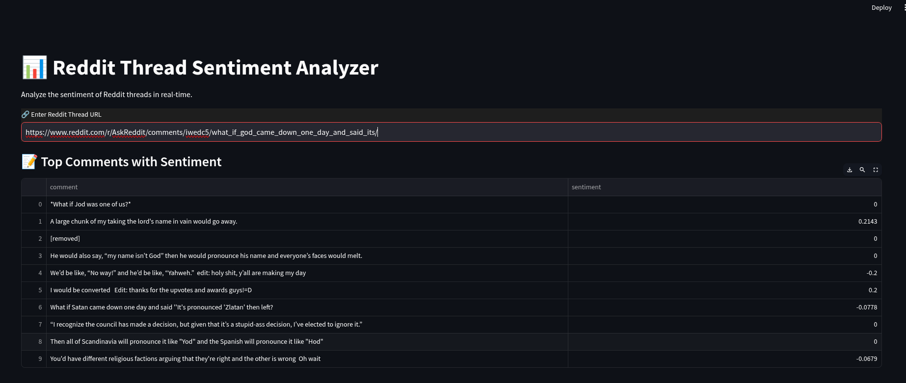

# Reddit Thread Sentiment Analyzer



## 📌 About
The **Reddit Thread Sentiment Analyzer** is a web application that scrapes comments from a Reddit thread and analyzes their sentiment using **TextBlob**. The app provides a visual representation of sentiment distribution using **Seaborn** and **Matplotlib**.

## 🎯 Features
✅ Scrapes comments from any Reddit thread  
✅ Performs sentiment analysis on extracted comments  
✅ Provides a **data table** of top comments and their sentiment  
✅ **Visualizes sentiment distribution** with a histogram  
✅ Modern **dark-themed UI** with Streamlit  

## 🖥️ Screenshot


## 🚀 Installation & Setup
### 1️⃣ Clone the Repository
```bash
git clone https://github.com/yourusername/reddit-sentiment-analyzer.git
cd reddit-sentiment-analyzer
```

### 2️⃣ Install Dependencies
Make sure you have Python installed, then run:
```bash
pip install -r requirements.txt
```

### 3️⃣ Set Up Reddit API
1. Go to [Reddit Apps](https://www.reddit.com/prefs/apps).
2. Create a new application (script type).
3. Copy the `client_id` and `client_secret`.
4. Replace them in `reddit_sents.py`:
```python
reddit = praw.Reddit(
    client_id="YOUR_CLIENT_ID",
    client_secret="YOUR_CLIENT_SECRET",
    user_agent="RedditScraper/1.0 (by /u/yourusername)"
)
```

### 4️⃣ Run the App
```bash
streamlit run reddit_sents.py
```

## ⚙️ Dependencies
- `streamlit`
- `praw` (Python Reddit API Wrapper)
- `textblob` (for sentiment analysis)
- `matplotlib` & `seaborn` (for visualizations)
- `pandas`


## 🛠️ Author
Developed by **@Weirdnemo** 🚀

